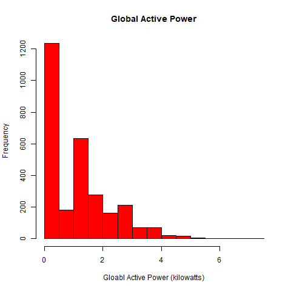

## Exploratory Data Analysis for JHU (COURSERA)

A additional file - load.r has been added which is responsible for the following:
- Loads libraries
- Downloads file
- loads semi-colan delimitaed file to a dataframe
- modifies the dataframe for dates
- filters for dates
- adds date and time column

plot1.R - Produces the required plot1 - histogram
 

plot2.R - Produces the required plot2 - line plot

plot3.r - produces the required plot3 - line plot with 3 lines, colors and legend

plot4.r - includes plots 2 and 3 as well as voltage and global reserve power.
